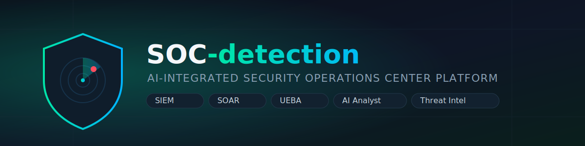

<div align="center">

<picture>
  <source srcset="./assets/logo.svg" type="image/svg+xml" />
  
</picture>

<br/>

### AI-Integrated Security Operations Center Platform

A full-stack SOC simulation with real-time SIEM detection, SOAR automation, UEBA, threat intelligence, digital forensics, and an AI security analyst.

[](https://soc-detection.vercel.app)
[](https://nextjs.org/)
[](https://fastapi.tiangolo.com/)
[](https://www.python.org/)
[](https://www.typescriptlang.org/)

[Live Demo](https://soc-detection.vercel.app) · [Getting Started](#getting-started) · [API Overview](#api-overview) · [Report a Bug](https://github.com/kharedhruva-tech/SOC-detection/issues)

</div>

---

## Overview

**SOC-detection** simulates the day-to-day workflow of a real Security Operations Center. A background log generator continuously produces synthetic security events, a rule-based detection engine matches them against patterns mapped to **MITRE ATT&CK** techniques, and the resulting alerts, incidents, and analytics stream live to a Next.js dashboard over WebSockets. Analysts can triage alerts, run automated SOAR playbooks, investigate assets and user behavior, and get natural-language threat explanations from an AI-assisted analyst module.

Built as an end-to-end portfolio project to demonstrate SIEM, SOAR, UEBA, and threat-intel concepts in a single interactive application.

## Features

| | |
|---|---|
| 🛰️ **Real-time SIEM engine** | Synthetic log generator + rule-based detection engine, alerts mapped to MITRE ATT&CK tactics/techniques |
| ⚡ **Live alert streaming** | WebSocket channel (`/ws/alerts`) pushes new alerts to the dashboard as they occur |
| 🧩 **Incident management** | Incident timeline, tasks, and full lifecycle tracking |
| 🤖 **SOAR playbooks** | Automated response playbooks triggered against live incidents |
| 👤 **UEBA** | User & Entity Behavior Analytics for anomaly detection |
| 🌐 **Threat intelligence** | IOC tracking with reputation scoring and threat-actor context |
| 🔍 **Digital forensics** | Forensic investigation views tied to incidents |
| 🧠 **AI Analyst** | Natural-language alert explanations, with optional real LLM integration |
| 📊 **Reporting** | SOC reporting dashboards for incidents and detections |
| 🔐 **Auth** | JWT-based authentication with role-based demo accounts |

## Tech Stack

**Frontend** — Next.js 16 (App Router) · React 19 · TypeScript · Tailwind CSS 4 · Recharts · React Flow · Framer Motion

**Backend** — FastAPI · SQLAlchemy (SQLite / PostgreSQL) · PyJWT + Passlib (bcrypt) · WebSockets

**Deployment** — Frontend on [Vercel](https://vercel.com/) · Backend on [Render](https://render.com/)

## Architecture

```
┌─────────────────┐        REST (/api/v1)         ┌──────────────────────┐
│                 │ ─────────────────────────────▶ │                      │
│  Next.js         │                                │  FastAPI Backend     │
│  Frontend         │ ◀───────────────────────────  │                      │
│  (Vercel)         │        WebSocket (/ws/alerts) │  SIEM · SOAR · AI    │
│                 │ ◀════════════════════════════  │  Log Gen · UEBA      │
└─────────────────┘        live alert stream       │  Threat Intel        │
                                                     └──────────┬───────────┘
                                                                │
                                                     ┌──────────▼───────────┐
                                                     │  SQLite / PostgreSQL │
                                                     └──────────────────────┘
```

## Project Structure

```
SOC-detection/
├── backend/
│   ├── app/
│   │   ├── api/routers/       # auth, incidents, alerts, playbooks, assets,
│   │   │                      # reports, ueba, intel, forensics
│   │   ├── models/            # SQLAlchemy models & Pydantic schemas
│   │   ├── services/          # siem_engine, soar_executor, ai_agent,
│   │   │                      # ai_analyst, log_generator, ws_manager
│   │   ├── config.py          # environment-based settings
│   │   ├── database.py        # DB session/engine setup
│   │   └── database_seed.py   # demo data & default accounts
│   └── requirements.txt
├── frontend/
│   ├── src/app/
│   │   ├── dashboard/         # siem, soar, ueba, intel, forensics,
│   │   │                      # incidents, reports, hunting, vulnerability
│   │   ├── ai-analyst/ · alerts/ · incidents/ · login/ · playbooks/
│   └── package.json
├── assets/                    # README banner/logo
├── Procfile
└── render.yaml
```

## Getting Started

### Prerequisites

- Python 3.11+
- Node.js 18+
- npm / yarn / pnpm

### Backend Setup

```bash
git clone https://github.com/kharedhruva-tech/SOC-detection.git
cd SOC-detection

python -m venv venv
source venv/bin/activate      # Windows: venv\Scripts\activate

pip install -r backend/requirements.txt
uvicorn backend.app.services.main:app --reload --port 8000
```

API available at `http://localhost:8000` · interactive docs at `http://localhost:8000/docs`.

By default the backend uses a local SQLite database (`soc_platform.db`) and auto-seeds demo data (users, incidents, alerts, IOCs) on startup.

### Frontend Setup

```bash
cd frontend
npm install
npm run dev
```

App available at `http://localhost:3000`. Point it at your local backend by configuring the API base URL in `frontend/src` if you're not using the deployed backend.

### Environment Variables (Backend)

| Variable | Description | Default |
|---|---|---|
| `SECRET_KEY` | JWT signing secret | dev placeholder — set a real value in production |
| `USE_POSTGRES` | Use PostgreSQL instead of SQLite | `false` |
| `POSTGRES_USER` / `POSTGRES_PASSWORD` / `POSTGRES_SERVER` / `POSTGRES_PORT` / `POSTGRES_DB` | PostgreSQL connection settings | — |
| `SQLITE_DB_PATH` | Path to local SQLite file | `soc_platform.db` |

## Deployment

- **Frontend** is deployed on Vercel → [soc-detection.vercel.app](https://soc-detection.vercel.app)
- **Backend** is configured for Render via `render.yaml`, which installs `backend/requirements.txt` and starts the API with:
  ```bash
  uvicorn backend.app.services.main:app --host 0.0.0.0 --port $PORT
  ```

## API Overview

All routes are namespaced under `/api/v1`:

| Route | Purpose |
|---|---|
| `/auth` | Login / authentication |
| `/incidents` | Incident lifecycle management |
| `/alerts` | Alert retrieval and triage |
| `/playbooks` | SOAR playbook management & execution |
| `/assets` | Monitored asset inventory |
| `/reports` | SOC reporting |
| `/ueba` | User & entity behavior analytics |
| `/intel` | Threat intelligence / IOCs |
| `/forensics` | Digital forensics investigation data |

Live alerts stream over WebSocket at `/ws/alerts`.

## Brand Assets

| SVG (`assets/logo.svg`) | PNG (`assets/logo.png`) |
|---|---|
|  |  |

Use the SVG for crisp scaling (docs, site headers); use the PNG where SVG isn't supported (e.g. some social/OG previews).

## Disclaimer

This is a **simulation/demo platform** built for learning and portfolio purposes. Logs, alerts, and threat intelligence are synthetically generated and should not be treated as a production security monitoring solution.

## License

No license has been specified for this project yet. All rights reserved by the author unless a license is added.

## Author

<div align="center">

Built with 🛡️ by **[kharedhruva-tech](https://github.com/kharedhruva-tech)**

</div>
